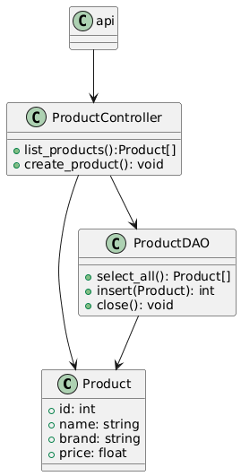
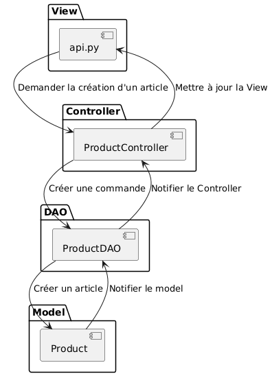
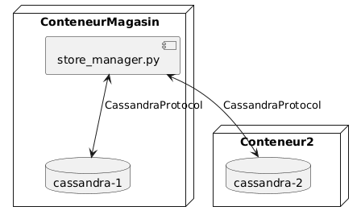

# Store Manager L09 - Documentation d'Architecture
Ce document, basé sur le modèle arc42, décrit l'API REST de gestion de magasin avec base de données distribuée Apache Cassandra pour le Labo 09, LOG430.

## 1. Introduction et Objectifs

### Panorama des exigences
L'application « Store Manager » a évolué d'un monolithe vers une architecture microservices event-driven. Pour le Labo 09, nous franchissons une étape cruciale : la migration vers une architecture entièrement distribuée avec Apache Cassandra comme base de données distribuée. Cette évolution prépare l'application pour un déploiement cloud à grande échelle.

L'application démontre :
- L'implémentation d'une API REST avec Flask et base de données distribuée
- L'utilisation d'Apache Cassandra pour la persistance distribuée
- La réplication automatique des données à travers un cluster multi-nœuds
- La gestion de la cohérence et de la disponibilité dans un système distribué
- Les concepts de keyspace, facteur de réplication et distribution de données

### Objectifs qualité
| Priorité | Objectif qualité | Scénario |
|----------|------------------|----------|
| 1 | **Haute disponibilité** | Le système continue de fonctionner même si un ou plusieurs nœuds Cassandra tombent en panne |
| 2 | **Scalabilité horizontale** | Ajout de nouveaux nœuds Cassandra sans interruption de service |
| 3 | **Résilience** | Les données sont répliquées automatiquement selon le facteur de réplication configuré |
| 4 | **Distribution native** | Élimination de la synchronisation manuelle entre bases de données |
| 5 | **Maintenabilité** | Séparation claire des responsabilités via les patrons MVC et DAO |

### Parties prenantes (Stakeholders)
- **Développeur·euses** : Apprendre l'architecture de bases de données distribuées et les principes de Cassandra
- **Employé·es du magasin** : Utilisatrices et utilisateurs gérant les articles, commandes et stock via l'API
- **Client·es du magasin** : Utilisatrices et utilisateurs finales servis par l'application (indirectement via les interactions avec les employé·es)

## 2. Contraintes d'architecture

| Contrainte | Description |
|------------|-------------|
| **Technologie** | Utilisation de Python 3.11, Flask, Apache Cassandra 4.1 et Docker |
| **Base de données** | Apache Cassandra avec architecture sans point de défaillance unique |
| **Déploiement** | Déploiement en conteneurs Docker avec cluster Cassandra multi-nœuds |
| **Réplication** | Facteur de réplication configurable (minimum 1 pour dev, 2-3 pour production) |
| **Éducatif** | L'application doit clairement démontrer les principes des bases de données distribuées et la réplication de données |
| **Configuration** | Utilisation de variables d'environnement pour toutes les configurations sensibles |

## 3. Portée et contexte du système

### Contexte métier

Le système permet la gestion de produits dans un environnement distribué :
- Créer des produits avec persistance distribuée automatique
- Consulter tous les produits avec lecture depuis n'importe quel nœud du cluster
- Garantir la disponibilité des données même en cas de défaillance de nœuds
- Supporter une scalabilité horizontale pour augmenter la capacité

### Contexte technique
- **Applications clientes** : Postman, applications web/mobiles, services externes
- **Couche API** : API REST Flask avec endpoints CRUD
- **Couche base de données** : Cluster Apache Cassandra (1 à 3 nœuds)
- **Communication** : Requêtes HTTP/HTTPS entre clients et API, CQL (Cassandra Query Language) entre API et Cassandra

## 4. Stratégie de solution

| Problème | Approche de solution |
|----------|---------------------|
| **Distribution des données** | Cassandra distribue automatiquement les données à travers le cluster selon une stratégie de partitionnement par hachage |
| **Haute disponibilité** | Architecture masterless avec réplication configurable (replication_factor) |
| **Cohérence des données** | Synchronisation automatique entre nœuds gérée par Cassandra |
| **Scalabilité** | Ajout de nœuds sans interruption de service grâce à l'architecture peer-to-peer |
| **Résilience** | Données répliquées sur plusieurs nœuds permettant la continuité même en cas de panne |
| **Configuration** | Variables d'environnement (.env) pour toutes les informations de connexion |

## 5. Vue des blocs de construction

## 6. Vue d'exécution

## 7. Vue de déploiement

## 8. Concepts transversaux

### Principes de base de données distribuées
- **Partitionnement** : Distribution automatique des données par hachage de la clé primaire
- **Réplication** : Copie des données sur plusieurs nœuds selon le facteur de réplication
- **Cohérence éventuelle** : Les données convergent vers un état cohérent à travers le cluster
- **Architecture masterless** : Tous les nœuds sont égaux, pas de point de défaillance unique

## 9. Décisions d'architecture
Veuillez consulter le fichier `/docs/adr/adr001.md` pour la décision d'utiliser Apache Cassandra.

## 10. Exigences qualité

### Haute disponibilité
- Architecture masterless : aucun point de défaillance unique
- Réplication configurable (RF=1 à 3)
- Lectures/écritures possibles même avec nœuds défaillants

### Scalabilité horizontale
- Ajout de nœuds sans interruption de service
- Distribution automatique des données sur nouveaux nœuds
- Performance linéaire avec l'ajout de nœuds

### Résilience
- Données répliquées selon le facteur de réplication
- Auto-réparation du cluster en cas de panne temporaire
- Hinted handoff pour les nœuds temporairement indisponibles

### Maintenabilité
- Séparation claire : Controller → Model → DAO
- Configuration externalisée dans .env
- Logs structurés pour le debugging
- Tests unitaires avec mocks pour isolation

### Performance
- Prepared statements pour optimisation des requêtes
- Distribution de charge de lecture à travers les nœuds
- Écriture parallèle sur plusieurs répliques

## 11. Risques et dettes techniques

| Risque | Impact | Mitigation |
|--------|---------|------------|
| **Split-brain dans le cluster** | Incohérence des données si le cluster se divise | Utiliser un nombre impair de nœuds et configurer des quorums appropriés |
| **Cohérence éventuelle** | Les lectures peuvent retourner des données légèrement obsolètes | Documenter le comportement et ajuster les niveaux de cohérence si nécessaire |
| **SimpleStrategy en production** | Non adapté pour multi-datacenter | Migrer vers NetworkTopologyStrategy pour production |

## 12. Glossaire

| Terme | Définition |
|-------|------------|
| **API** | Application Programming Interface |
| **CQL** | Cassandra Query Language, langage de requête similaire à SQL |
| **DAO** | Data Access Object, patron de conception pour abstraire l'accès aux données |
